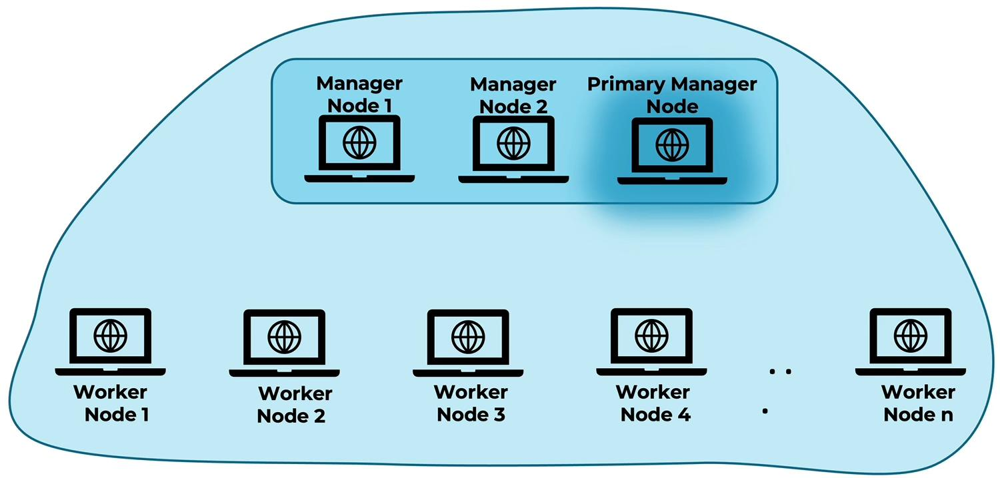

# Docker Swarm
Docker Swarm wird verwendet um eine Docker-Anwendung auf ein Cluster zu deployen 

## Exkurs: Microservices
Monolithisch: eine Anwendung die "alles" kann   
Microservices: mehrere kleine Anwendungen mit eigenen Aufgaben     
* Vorteile
  * jeder Microservice ist autark und kann eigenständig agieren
  * man kann einzelne Services skalieren, warten und entwickeln
* Nachteil
  * Komplexität über die Services hinaus (deploy, entwickeln)
  * es entstehen Abhängigkeiten zwischen Services

### Persistenz bei Microservices
Microservices die skaliert werden können sollen sollten stateless sein   
ohne Stateless Microservices gibt es Probleme bei Unique Datenhaltung   

## Was ist Docker Swarm
"docker compose" auf mehreren Hosts   
* Vorteil
  * verringerte Downtime
  * Skalierbarkeit ist erhöht/gegeben
  * Backups einfach erstellbar und wiederherstellbar

## Aufbau

* alles ist ein `Node`
* Manager-Node:
  * kan mehrere Manager-Node geben
  * es gibt immer nut einen Primary-Manager-Node (verwaltet die Gesamtverwaltung)
* Worker-Node:
  * kann mehrere Worker-Nodes geben (keine begrenzung oder weitere anforderung)
  * arbeitet die einzelnen Prozesse ab

Mehrere Nodes können (bisher) nur aktiv mit Linux verwenden werden (OS-Bedingte Probleme)   

## Swarm-Cluster aufbauen
`docker system info`: Info über alle Docker Konfigurationen   
`docker system info | grep "Swarm"`: prüfen ob Swarm gerade aktiv ist oder nicht   
`docker swarm init`: Swarm starten und initialisieren   
`docker swarm join --token `: einem Swarm-Cluster beitretten (Token und Host werden bei Manager-Node start mit ausgegeben)   
`docker swarm leave`: ein Swarm-Cluster verlassen   
`docker node ls` auf Manager-Node: Infos zu allen Nodes   
   
`docker service create`: startet einen Swarm-Service
`docker service ls`: listet alle Swarm-Service auf
`docker service update`: aktualisiert die Swarm-Service Konfiguration
`docker service remove`: Swarm-Service entfernen
`docker service ps {SERVICENAME}`: listet alle Swarm-Task auf eines bestimmten Swarm-Service   

## Secrets in Swarm
`docker sectet ls`: Liste alle Secret   
`printf "foobar" | docker secret create abc -`: speichert `foobar` in das Secret mit den namen `abc`   
`docker service create --secret abc nginx`: startet ein Service `nginx` mit dem Secret `abc`   
secrets werden unter `/run/secrets` im container abgelegt   
`docker service create --secret source=abc,target=/tmp/def {SERVICE}`: Secret-Datei `abc` wird unter `/tmp/def` abgelegt   

## Swarm Configs
`docker config ls`: Liste aller Configs      
`docker config create my-config config-file.txt`: erstellt eine Config `my-config` mit `config-file.txt` als inhalt/verweis   
`docker service create --config my-config nginx`: erstellt ein Service `nginx` mit der config `my-config`    
configs werden im root-Verzeichnis abgelegt   
`docker service create --config source=my-config,target=/etc/my-config {SERVICE}`: config `my-config` wird unter `/etc/my-config` abgelegt   

## Swarm mit docker-compose.yml 
`docker stack ls`: Liste aller Stacks
`docker stack deploy -c compose.yml service_1_2`: erstellt einen "Stack" anhand des `compose.yml` file mit dem namen `service_1_2`   
hier muss `version` in der compose.yml angegeben werden, da sonst von 1.0 ausgegangen wird   
`docker stack services service_1_2`: listet alle replicas in einem Stack auf   
`docker stack remove service_1_2`: löscht den kompletten Stack `service_1_2` (mit allen Containern und Netzwerken)   
